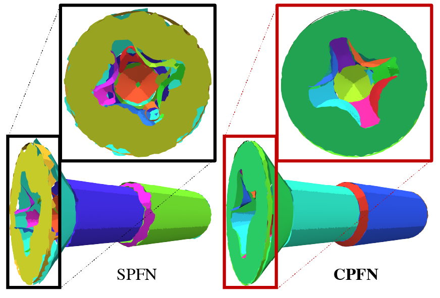

# CPFN: Cascaded Primitive Fitting Networks for High Resolution Point Clouds

This repository contains a PyTorch implementation of the paper:

[CPFN: Cascaded Primitive Fitting Networks for High Resolution Point Clouds](https://arxiv.org/abs/2109.00113). 
<br>
[Eric-Tuan Lê](http://erictuanle.com), 
[Minhyuk Sung](https://mhsung.github.io),
[Duygu Ceylan](http://www.duygu-ceylan.com),
[Radomir Mech](https://research.adobe.com/person/radomir-mech/),
[Tamy Boubekeur](https://perso.telecom-paristech.fr/boubek/),
[Niloy J. Mitra](http://www0.cs.ucl.ac.uk/staff/n.mitra/)
<br>
ICCV 2021


## Introduction

Representing human-made objects as a collection of base primitives has a long history in computer vision and reverse engineering. In the case of high-resolution point cloud scans, the challenge is to be able to detect both large primitives as well as those explaining the detailed parts. While the classical RANSAC approach requires case-specific parameter tuning, state-of-the-art networks are limited by memory consumption of their backbone modules such as PointNet++, and hence fail to detect the fine-scale primitives. We present Cascaded Primitive Fitting Networks (CPFN) that relies on an adaptive patch sampling network to assemble detection results of global and local primitive detection networks. As a key enabler, we present a merging formulation that dynamically aggregates the primitives across global and local scales. Our evaluation demonstrates that CPFN improves the state-of-the-art SPFN performance by 13-14% on high-resolution point cloud datasets and specifically improves the detection of fine-scale primitives by 20-22%

<p align="center">
    
</p>

## Environment
First, you will need to set up the environment to run the code. We recommend using **Anaconda**:
```bash
conda create -n cpfn python=3.7
conda activate cpfn
```
Run the following command to install all necessary packages:
```bash
pip install -r requirements.txt
```
Then install PyTorch and compile PointNet++ modules for faster computation:
```bash
cd PointNet2/pointnet2_ops/
python setup.py build_ext --inplace
cd ../..
```
## Data
You can download the High-Resolution TraceParts dataset from SPFN repository.
```bash
wget --no-check-certificate https://shapenet.cs.stanford.edu/media/minhyuk/spfn/data/spfn_traceparts_high_res.tar
```
The data should be placed in a **data/** directory. All **.h5** files should be in **data/TraceParts_v2**.

## Code
First, preprocess the dataset to obtain the low resolution point clouds and the local patches:
```bash
python Preprocessing/preprocessing_sampling_lowres.py --path_highres=data/TraceParts_v2/ --path_lowres=data/TraceParts_v2_lowres/ --path_split_file=Dataset/train_models.csv --nb_query_points=8192 --ratio_cpu_touse=0.70
python Preprocessing/preprocessing_sampling_lowres.py --path_highres=data/TraceParts_v2/ --path_lowres=data/TraceParts_v2_lowres/ --path_split_file=Dataset/test_models.csv --nb_query_points=8192 --ratio_cpu_touse=0.70
```
and then:
```bash
python Preprocessing/preprocessing_sampling_patch.py --path_highres=data/TraceParts_v2/ --path_lowres=data/TraceParts_v2_lowres/ --path_patches=data/TraceParts_v2_patches/ --path_split_file=Dataset/train_models.csv --scale=0.05 --max_number_patches=32 --num_points_patch=8192 --ratio_cpu_touse=0.70
python Preprocessing/preprocessing_sampling_patch.py --path_highres=data/TraceParts_v2/ --path_lowres=data/TraceParts_v2_lowres/ --path_patches=data/TraceParts_v2_patches/ --path_split_file=Dataset/test_models.csv --scale=0.05 --max_number_patches=32 --num_points_patch=8192 --ratio_cpu_touse=0.70
```

After the initial preprocessing, you can train the Global SPFN on the low-resolution **TraceParts_v2** dataset:
```bash
python training_SPFN.py --config_file=Configs/config_globalSPFN.yml --lowres_dataset=data/TraceParts_v2_lowres --network=GlobalSPFN
```
and then run the evaluation on both the training and the test set. Evaluating on the training set is needed here to produce the global and local features of all point clouds.
```bash
python evaluation_globalSPFN.py --config_file=Configs/config_globalSPFN.yml --lowres_dataset=data/TraceParts_v2_lowres/ --highres_dataset=data/TraceParts_v2/ --output_folder=data/TraceParts_v2_globalspfn/ --evaluation_set=train --path_patches=data/TraceParts_v2_patches/ --scale=0.05
python evaluation_globalSPFN.py --config_file=Configs/config_globalSPFN.yml --lowres_dataset=data/TraceParts_v2_lowres/ --highres_dataset=data/TraceParts_v2/ --output_folder=data/TraceParts_v2_globalspfn/ --evaluation_set=test --path_patches=data/TraceParts_v2_patches/ --scale=0.05
```

In parallel, you can also train the Patch Selection Network.
```bash
python training_PatchSelection.py --config_file=Configs/config_patchSelec.yml --lowres_dataset=data/TraceParts_v2_lowres/ --highres_dataset=data/TraceParts_v2/ --scale=0.05
```
In evaluation mode, we rely on the Patch Selection Network predictions to generate the local patches. Primitives information are considered unknown.
```bash
python evaluation_PatchSelection.py --config_file=Configs/config_patchSelec.yml --lowres_dataset=data/TraceParts_v2_lowres/ --highres_dataset=data/TraceParts_v2/ --heatmap_folder=data/TraceParts_v2_heatmaps/ --scale=0.05
```

Finally, you can train the Local SPFN on the local patches. But first, you need to preprocess the dataset to create **.h5** files for each local patch:
```bash
python Preprocessing/preprocessing_creation_patch.py --path_highres=data/TraceParts_v2/ --path_lowres=data/TraceParts_v2_lowres/ --path_features=data/TraceParts_v2_globalspfn/ --path_patches=data/TraceParts_v2_patches/ --path_split_file=Dataset/train_models.csv --scale=0.05 --max_number_patches=32 --num_points_patch=8192 --ratio_cpu_touse=0.70
python Preprocessing/preprocessing_creation_patch.py --path_highres=data/TraceParts_v2/ --path_lowres=data/TraceParts_v2_lowres/ --path_features=data/TraceParts_v2_globalspfn/ --path_patches=data/TraceParts_v2_patches/ --path_split_file=Dataset/test_models.csv --scale=0.05 --max_number_patches=32 --num_points_patch=8192 --ratio_cpu_touse=0.70
```
Then, run the training command:
```bash
python training_SPFN.py --config_file=Configs/config_localSPFN.yml --lowres_dataset=data/TraceParts_v2_lowres/ --network=LocalSPFN --path_patches=data/TraceParts_v2_patches/ --scale=0.05
```

To evaluate the full pipeline, simply run the following script:
```bash
python evaluation_localSPFN.py --config_file=Configs/config_localSPFN.yml --lowres_dataset=data/TraceParts_v2_lowres/ --highres_dataset=data/TraceParts_v2/ --dir_spfn=data/TraceParts_v2_globalspfn/ --dir_indices=data/TraceParts_v2_heatmaps/ --output_folder=data/TraceParts_v2_localspfn/ --scale=0.05
```

## Cite
Please cite our work if you find it useful:
```latex
@InProceedings{Le_2021_ICCV,
    author    = {L\^e, Eric-Tuan and Sung, Minhyuk and Ceylan, Duygu and Mech, Radomir and Boubekeur, Tamy and Mitra, Niloy J.},
    title     = {CPFN: Cascaded Primitive Fitting Networks for High-Resolution Point Clouds},
    booktitle = {Proceedings of the IEEE/CVF International Conference on Computer Vision (ICCV)},
    month     = {October},
    year      = {2021},
    pages     = {7457-7466}
}
```
